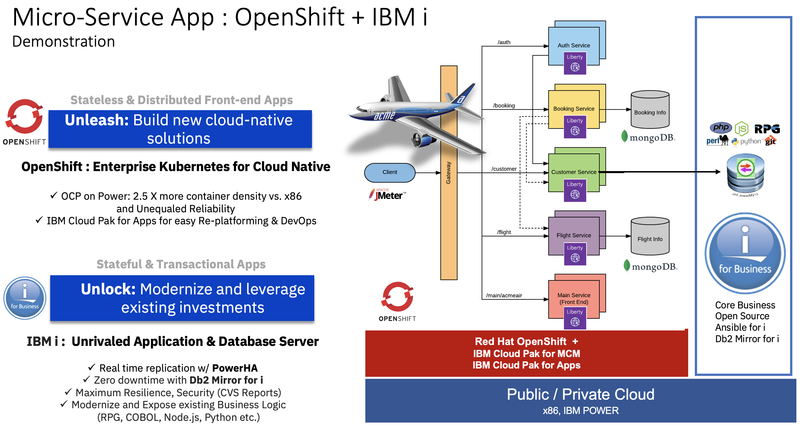
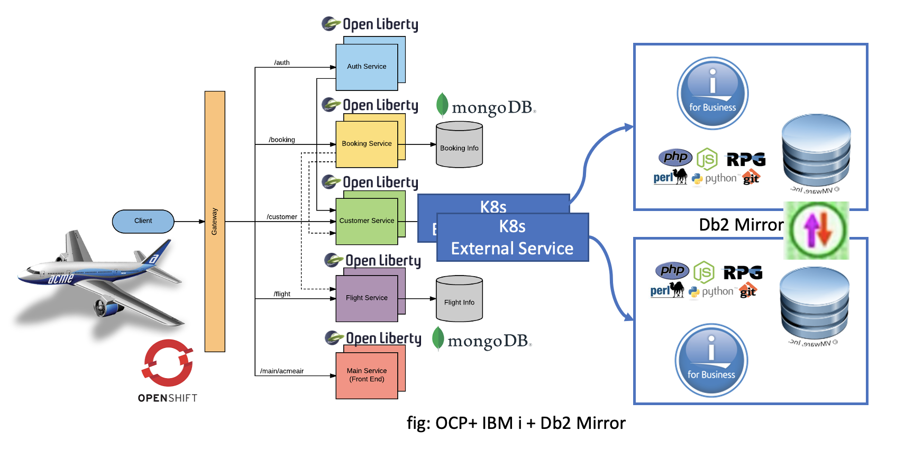
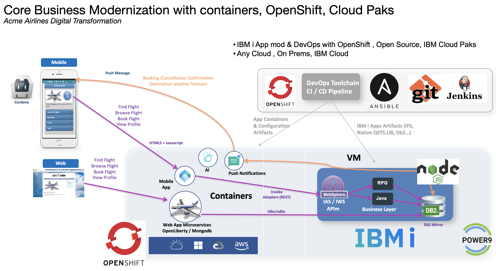

## Demonstration : Micro-service Applications with IBM i & OpenShift 

Link to the full presentation "[OpenShift & IBM i introduction](https://ibm.box.com/s/dnv8rhh2ikim70t69kcjf9qblehblc0u)" demonstrating how to combine the state of the art db server IBM i/Db2 for i with a cloud native microservice architecture on Redhat OpenShift.

### Acme Air Customer Service - Java/Liberty + JDBC (Db2 for i) version

Implementation of the Acme Air Customer Service for Java/Liberty. The primary task of the customer service is to store, update, and retrieve customer data on Db2 for i. It can be adapted for any jdbc based database server.  Fork from the Mongodb based [Customer Service](https://github.com/blueperf/acmeair-customerservice-java).  

IBM i (Db2 for i) is a rock solid database server with HA and DR capabilities. This example shows you how to integrate the Kubernetes and Stateless world with the Stateful and Transactional world on IBM i. 
With Db2 for i:  potentially ZERO interruption, ZERO downtime, and 24x7 access to your database and business critical applications. 

## Build Instruction for OpenShift / MiniShift or CodeReady Containers

- First,  git clone this repository, in addition to the other microservices from the [BluePerf project](https://github.com/blueperf/acmeair-mainservice-java). 
use the test branch : branch microprofile-3.3 , use the git option `--branch microprofile-3.3` (do that for each microservice in the BluePerf project)
- Download and Copy an up to date jdbc driver in the 'drivers' folder. ex: jt400.jar
- Use the scripts in the 'drivers' folder to create the acmeair database and import the initial data.
- Install maven, oc cli , docker or podman client first. Refer to the original BluePerf project instructions. 
- Follow the instruction on BluePerf (link above) to build & deploy the other microservices.
- Build and deploy this micro-service (replacing the initial [Customer Service](https://github.com/blueperf/acmeair-customerservice-java) by this Db2 for i alternative from in a single command using the following commands. 
Note: Feel free to change that, but the default user profile used here is 'acmeair' , password is 'password', library (sql collection) is acmeair. Update the Deployment environment variable values according to your environement (user, password, lib list)
### Example 1 - Single Db2 for i server:
- `$ export DB2FORI_HOSTNAME=bendemo.10.7.19.71.nip.io`
- `$ cd scripts`
- `$ ./buildAndDeployToOpenshift-CustomerService.sh  default-route-openshift-image-registry.apps-crc.testing/acmeair image-registry.openshift-image-registry.svc:5000/acmeair acmeair-acmeair.apps-crc.testing docker open-liberty:full `

### Example 2: K8s + Db2 Mirror and Alternate database server (jdbc, Db2 Mirror for i)
Refer to this [jdbc/jtopen documentation](http://jt400.sourceforge.net/doc/com/ibm/as400/access/doc-files/JDBCProperties.html#alternate). This scenario with automatic failover from a micro-service requires the LATEST version of jtopen, to be placed in the `drivers` folder.
 
- `$ export DB2FORI_HOSTNAME=bendemo.10.7.19.71.nip.io`
- `$ export DB2FORI_HOSTNAME_ALT=db2acmeair2.10.3.60.81.nip.io`
- `$ cd scripts`
- `$ ./buildAndDeployToOpenshift-CustomerService.sh  default-route-openshift-image-registry.apps.sandbox.power.mpl/bmarolleau  default-route-openshift-image-registry.apps.sandbox.power.mpl/bmarolleau acmeair-bmarolleau.apps.sandbox.power.mpl podman `

## Architecture Overview : 
